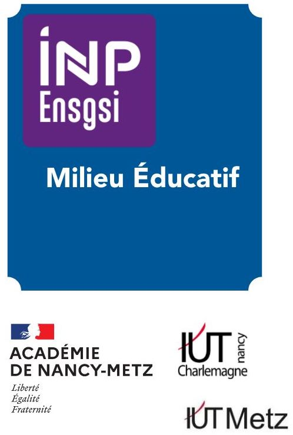
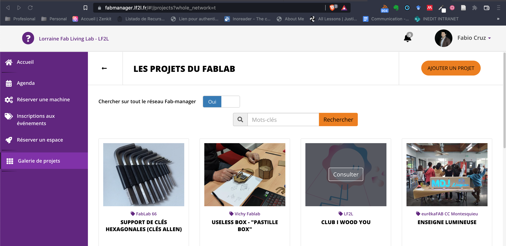
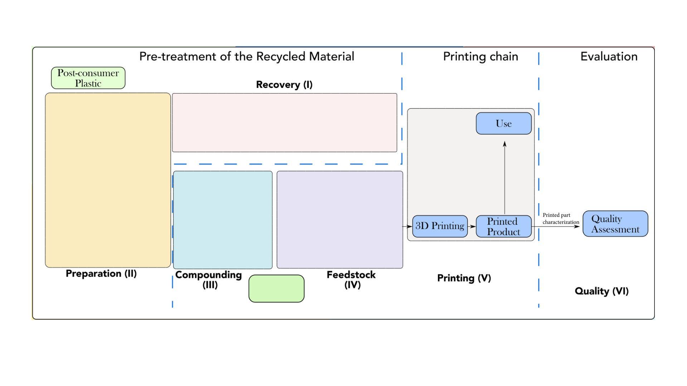

```{r setup, include=FALSE}
# Load packages -----
library(tidyverse)
library(xaringanExtra)
library(xaringanthemer)
library(fontawesome)
library(fontawesome)
library(here)
library(vembedr)

source(here("xaringan-themer.R"))

options(htmltools.dir.version = FALSE)
knitr::opts_chunk$set(
  fig.width=9, fig.height=3.5, fig.retina=3,
  out.width = "100%",
  cache = TRUE,
  echo = FALSE,
  message = FALSE, 
  warning = FALSE,
  hiline = TRUE,
  fig.align='center'
)

# Link for the Figures
URL = c('https://raw.githubusercontent.com/fabbiocrux/Figures/main/')


library(xaringanBuilder)
```


class: title-slide, center, bottom

.pull-left[
```{r, echo=FALSE, out.width = '60%', fig.align='center'}
knitr::include_graphics(paste0(URL, 'Logos/ENSGSI/2022-ENSGSI.jpeg'))
```
]
.pull-right[
```{r, echo=FALSE, out.width = '70%', fig.align='center'}
knitr::include_graphics(paste0(URL, 'Logos/ERPI/ERPI.svg'))
```
]


****
#  `r rmarkdown::metadata$title`

60-62MCF 0182 (ENSGSI-ERPI)


### `r fa("comment", fill = "steelblue")` `r rmarkdown::metadata$author`

`r fa("user-friends", fill = "steelblue")` `r rmarkdown::metadata$subtitle` | `r fa("map-marker-alt", fill = "steelblue")` `r paste0("Nancy ",  format(Sys.time(), '%d %B, %Y'))`


???

Bonjour à tous. 
- D’abord je vous remercie de m’accueillir aujourd’hui.
- Je m'appelle Fabio Cruz et actuellement je suis chercheur contractuel ici à l’ERPI. 
- J’ai le plaisir de vous présenter ma candidature pour le role de Maître de Conférence à l’ENSGSI en lien avec le laboratoire ERPI. 
- [Promise]: A la fin de ces 20 min, Je veux vous montrer comment mon parcours et mes expériences en recherche et ensignement peuvent soutenir nos futures ingénieurs en innovation en portent des valeurs d'Eco-responsabilité pour les enjeux societaux actuels.


---
class: middle

# Sommaire 

.grey_Inedit[
1. .large.bg-yellow[**Mon profil et parcours**]
1. Proposition d'intégration à l'ENSGSI et à l'ERPI 
1. Engagements collectifs actuels et perspectives

]   


???


1. Je commence par exposer mon profil et le récapitulatif de mon parcours. 

2. Ensuite, Je vous présente mon projet d’intégration coté recherche et coté enseignement.

3. Et je finalise avec mes engamenet collectives et de Valorisation actuels et futurs 

Commençons donc par mon profil.
---

.pull-left-1[
```{r, echo=FALSE, out.width = '40%', fig.align='center', out.extra='class="rounded"'}
knitr::include_graphics(paste0(URL, 'Fabio/Fabio-300x300.jpg'))
```

34 ans - .large[`r emo::ji("colombia")`| `r emo::ji("france")`|]  <br>
Ingénieur Mécanique et <br>
Master II - Design Global.<br>
PhD. en Génie des Systèmes Industriels <br>
CNU : **60** – **62**   <br>
]

???

- J'ai 34 ans. Je suis d'Origine Colombienne.

--

.pull-right-2[ 

- **2005 - 2012**:  Universidad Nacional de Colombie
   - .large[`r emo::ji("brazil")`] **2010**: International trainee 
   
```{r, echo=FALSE, out.width = '90%', fig.align='center'}
knitr::include_graphics("images/brazil/Brazil.png")
```
]


???
- Je suis ingénieur mécanique formé à l’Université Nacional de Colombie.
- en 2010; J’ai eu l’opportunité de travailler 11 mois au Bresil pour une entreprise de montage mécaniques qui travail avec des entreprises de l’explotation minière.
- Cette première expérience international m’a ouvert le sprit à trois elements:

1. La langue, bien évidement, et le premier choque culturel.
2. La notion Valeur et la notion Innovatio. --> Internationaliser
3. L'enjeux environmental comm vecteur fort de mon parcours
---

.pull-left-1[
```{r, echo=FALSE, out.width = '40%', fig.align='center', out.extra='class="rounded"'}
knitr::include_graphics(paste0(URL, 'Fabio/Fabio-300x300.jpg'))
```

34 ans - .large[`r emo::ji("colombia")`| `r emo::ji("france")`|]  <br>
Ingénieur Mécanique et <br>
Master II - Design Global.<br>
PhD. en Génie des Systèmes Industriels <br>
CNU : **60** – **62**   <br>

]

.pull-right-2[
- **2005 - 2012**:  Universidad Nacional de Colombie
   - .large[`r emo::ji("brazil")`] **2010**: International trainee 
   

***   
- .large[`r emo::ji("france")`] Mémoire fin d'études
- **2012 - 2013**: Master M2: Management de l'Innovation  <br>
- **2013 - 2016**: Thèse de Doctorat France <br>
- **2017 - 2021**: Post-doc ERPI / Lorraine Fab Living Lab (LF2L) <br>
- **2021**: Post-doc InSyTE (Anciennement CREIDD) à l'UTT <br>
- **2022 - **: Chercheur ERPI / LF2L / Green Fablab
]


???

- Je suis rétourné pour finir les cycle ingénieur, 
- et 1 ans après, Mon aventure en France commence.

- Initialement pour une mémoire de Fin d’études, 
- un master 2 en Management de L’innovation et du design Industriel
- Après thèse de doctorat 
- Et puis en tant que Post-docs au sein du LLorraine Fab living Lab.
 
- INSYTE Equipe de Recherche Interdisciplinaire de Societe, Technologie et Environment.

- CREIDD Equipe de Recherche interdisciplinaire sur la transition vers la soutenabilité des systèmes sociotechniques
---


 .pull-left-2[
```{r, echo=FALSE, out.width = '90%', fig.align='center'}
knitr::include_graphics(paste0(URL, 'LF2L/Fablab/Fablab-01.png'))
```
]
.pull-right-1[
```{r,  out.width = '90%', fig.align='center'}
knitr::include_graphics(paste0(URL, 'Foldarap/Emmanuel-00.jpeg'))
```

```{r,  out.width = '90%', fig.align='center'}
knitr::include_graphics(paste0(URL, 'Foldarap/Wiki.png'))
```

]


???

- Mon aventure en France commence cette meme espace Créaction il y a 10ans.

- ENSGSI et ERPI ont été pionnier sur l'implementation de la notion Fablab,  open innovation et fabrication additive.

- J'ai eu opportunité de Travailler avec Emmanuel Gilloz. --> Maker. 
- Il a conçu Foldarap
- Il a document en Open Source.
- La fabrication additive open source est née.

---
class: top, left
background-image: url("images/SDRAM-01.jpg")
background-position: 50% 90%
background-size: 85%

## Recyclage distribué pour la Fabrication additive

.small[[ACL] Journal of Cleaner Production - 2020]


???


- Mon objet de recherche est le Recyclage distribuéé pour la Fabrication additive OS.

- En 2020, dans notre publication dans le Journal of Cleaner Production, on demontre ces 6  étapes clés pour mettre en place une filière local de cette type.

---

class: top, left
background-image: url("images/SDRAM-02.jpg")
background-position: 50% 90%
background-size: 85%

## Recyclage distribué pour la Fabrication additive OS


???

- L'enjeux est de passer d'une matière qu'aujourd'hui on considère 'déchet plastique' ver une matière secondaire util pour le procédé d'impression 3D et eventuelment un produit.

--

background-image: url("images/SDRAM-03.jpg")

???

- Au meme temps, le l'interet est aussi de faire le lien de cette nouvelle filière avec le territoire.

- Car finalement, on doit se poser la question jusqu'à quels point ce type de solution technique est pertinent.

- Est un bonne iddéé?, Ou est une bonne false idéé?

- C'est pour cela, que nous dévons implementer une approche multi-critère et multi-echelle pour bien conmprendre tous les enjeux. 

- Cette proposition a été bien réçu par la communauté scientifique et montre que nouvelle modes de consumation et de manufacture doivent être explorer aujourd'hui.

--

background-image: url("images/SDRAM-04.jpg")


???

- Permet moi de vous montrer rapidement la premier échelle d'etude: La machine
---
class: bottom, left
background-image: url("images/Recherche-01.jpg")
background-position: 50% 20px
background-size: 85%

### Validation technique de l'open source

???

- Mon apport en apport en recherche était de challenger la croyance que cette type de machines était de Gadgets.

- Est-ce que l'imprimante 3D qu’il a conçu, et que moi-meme j’ai monte, avec tout la précision qu’in principiant peut avoir, est-il suffisament reproductible et fiable pour la considérer comme une outil robuste?.

- Nous avons démontré en 2014 que oui. La machine l'est.

- Pas pour rien, l'explosion d'applications

- Avec des collegèes de l'ecole de Chirurgie
- MAchoire imprime comme support pédagogique à l'apprentisage du geste de performation pour l'odontologie
- Os de cochon et logistique associe
- Matière impression comme support à la pedagogie.

- Fused Granular farication --> Opportunité
- Plus besoins de filament.
- Hypthese est que facilitéra le processus d'impression
- On a besoin plus de recherche pour mieux comprendre et maitriser les parametes importantés d'impression avec la qualité.


---
class: top, left
background-image: url("images/SDRAM-04.jpg")
background-position: 50% 90%
background-size: 85%

## Recyclage distribué pour la Fabrication additive

???

- Mon objetif dans ce premier echele est de valider la qualité de machines open source.
--

background-image: url("images/SDRAM-05.jpg")


???

-Ma thèse de doctorat a pris une direction très innovant a ce moment là:
- On a elérgie le scope pour inclure cette fois-ci l’impact de la matière dans le procédé.
- La question de départ était savoir, Combien de fois je pourrai utiliser la matière plastique dans le procédé d’impression. Quid de la qualité (mécanique) de l’objet?

---

class: bottom left
background-image: url("images/Recherche-02.jpg")
background-position: 50% 10px
background-size: 88%

### Faisabilité technique de recyclage pour la FA open source. 


???

- Ma thèse a été en lien avec Laboratoire de Réactions et Génie de Procédes.
- J'ai fait un gros travail expérimentaux  pour comparer la dégration de la matire avec le procédé d' impression et l'injection comme reference.

- Ces resultats on fait l'objet d'une conference très connu à l'Université de Texas et dans la publication dans Journal d'Additive Manufacturing, qui est aujourd'hui la reference dans le domaine.


---

class: top, left
background-image: url("images/SDRAM-05.jpg")
background-position: 50% 90%
background-size: 85%

## Recyclage distribué pour la Fabrication additive


???

- Ces avancés ont été bien réçus par la communauté scientifique, et depuis 2017 dans la soutenance de ma thèse,   

- c'est que je parlé la notion Green Fablab pour démocratiser cette demarche dehor du laboratoire de recherche.

- Sortir du Labo vers la société.


--

background-image: url("images/SDRAM-06.jpg")


???

-  Pendant ma thèse je participe dans le démarrage du Lorraine Fab Living Lab,
- Et literalment du lendemain du jour de la soutenance, je me suis installé dans le locaux pour initier l’aventure.

- Ace momment, on s'interesait à La question chaine d'approvisionnement.
- COmment la concevoir? quel parametres? quelles echelle? pertinent pour cette nouvelle filière.

---

class: bottom, left
background-image: url("images/Recherche-03.jpg")
background-position: 50% 10px
background-size: 85%

###  Validation de la chaîne d'approvisionnement


???

- J'ai eu la chance d'accompagner les travaux de Master et de Doctoral de PAvlo Santader pour y répondre.

- Ses travaux de thèse on demontrer une premier  model logistique pertinenet, 
- une premieère proposition d'optimisation linéaire mathematique multi-critère. 
- et nous avons fait le cas d'example de NAncy.
- Ses avance ont fait l'objet de publication dans la conference ICE concernant la proposition du model
- et dans le journal Resources, COnservatino and Recycling, dont l'originalité etait précisemnet ce nouveau cadre d'étude.

- En parallel, 
- J'ai travaillé avec des étudiants en alternance de l'Ecole CESI pour faire une conception Open hardware afin de transposer ses machines que j'ai vu au LRGP dans un cadre Fablab. 
- Egalement, l'experience de ectte approache a été partagé dans un conference , pour montrer l'apport pédagogie 
- et comment stretegie du projet peut alimenter la  strategie global de l'espace d'innovation comme le LF2L.


---

class: top, left
background-image: url("images/SDRAM-06.jpg")
background-position: 50% 90%
background-size: 85%

## Recyclage distribué pour la Fabrication additive

--
background-image: url("images/SDRAM-07.jpg")

???

- Reccement, on s'interese à l'identificatino des indicateur pertinent pour cette nouvelle filière.
- Parce que si on imagine une spece de dashboard pour piloter l'implementatin de cette type de filière dans un context particulière, 
- Pouvoir reperer les indicateur cles des cette reseaux.


---

class: bottom, left
background-image: url("images/Recherche-04.jpg")
background-position: 50% 10%
background-size: 90%

###  Identification des indicateurs

???

- Cette année on a fait un revue systematique de la litterature pour identifier ces indicateurs.
- Indepandanment du domain, nous avons pu surligner les indicators technologiques, politique et sociaux que nous devons viser. 

---
class: top, left
background-image: url("images/SDRAM-08.jpg")
background-position: 50% 90%
background-size: 85%

## Recyclage distribué pour la Fabrication additive

---
class: middle, left
background-image: url(`r paste0(URL, 'Everest-bio/logos/Logos.jpg')`)
background-position: 100% 0%
background-size: 80%

## Everest Bio

.pull-left[
Analyse de Cycle de vie 
```{r, out.width = '100%'}
knitr::include_graphics(paste0(URL, 'DRAM/LCA/Cristian.png'))
```
.tiny[(Publi en cours de soumission)]
]
.pull-right[
Services écosystémiques
```{r, out.width = '60%', fig.align='center'}
knitr::include_graphics(paste0(URL, 'Ecoservices/Eco-Services-00.jpg'))
```

]

Méthodologie  d’évaluation des services écosystémiques rendus par des activités industrielles afin d'améliorer la prise de décisions des acteurs industriels et publics.


???

J'ai travail dans 


---

## Projet EU H2020 INEDIT

<br>

.pull-left-1[
```{r, out.width = '80%'}
knitr::include_graphics(paste0(URL, 'Inedit/Inedit-01.svg'))
```

Open **IN**novation **E**cosystem for **D**o-**I**t-**T**ogether process
]

.pull-right-2[
```{r, out.width = '100%'}
knitr::include_graphics(paste0(URL, 'Inedit/WP2/DIT-model-00.png'))
```
]

---

## Projet EU H2020 INEDIT
### Demonstrateur Green Fablab

.pull-left[
```{r, out.width = '100%'}
knitr::include_graphics(paste0(URL, 'Inedit/WP7/INEDIT_Brochure-01.jpg'))
```
]

.pull-right[

- From DYI to the definition DIT `r fa("check-circle", fill = "steelblue")`
- Formalisation DIT `r fa("check-circle", fill = "steelblue")`

- Open Manufacturing Demostrator (OMDF) `r fa("spinner", fill = "steelblue")`

- .bg-green[**Demostrator (UL)**] `r fa("spinner", fill = "steelblue")`

```{r, out.width = '80%'}
knitr::include_graphics(paste0(URL, 'Green-Fablab/Logo-GF.png'))
```

]

---
class: bottom, left
background-image: url(`r paste0(URL, 'Octroi/Octroi-00.png')`)
background-position: 50% 50%
background-size: 90%


---

class: top
background-image: url("images/Evolution-GF.jpg")
background-position: 50% 70%
background-size: 80%


# Du laboratoire vers la Société


.pull-down.bg-yellow[... Mon **parcours d'enseignement**]

---

## Mon Parcours d'enseignement

.pull-left[
```{r,  out.width = '50%', fig.align='center'}

```
]

.pull-right[
Volume: 292 HETD

Publics:

- Cycle Preparatoire
- Cycle Ingénieur 1AI, 2AI et 3AI
- Master IDEAS
- Licence Profesionnel

]

Recherche - Résistances de Matériaux - Conception Mécanique - 
Economie Circulaire 

???
- J'ai comptabilisé auprès de publique 
- 

---
class: top, left
background-image: url("images/Cursos-01.jpg")
background-position: 50% 100%
background-size: 88%

## Mon Parcours d'enseignement

---
class: top, left
background-image: url("images/Cursos-02.jpg")
background-position: 50% 100%
background-size: 88%

## Mon Parcours d'enseignement


???
- J'ai déjà integre la plateforme du LF2L et du Green Fab

---
class: top, left
background-image: url("images/Cursos-03.jpg")
background-position: 50% 100%
background-size: 88%

## Mon Parcours d'enseignement


---

class: middle

# Sommaire 

.grey_Inedit[
1. Mon profil et parcours
1. .large.bg-yellow[**Proposition d'intégration à l'ENSGSI et à l'ERPI **]
1. Engagements collectifs actuels et perspectives

]   

---


## Attendus du Poste : Enseignement

.small.pull-left[
**Conception / Innovation**

- CI3 : Conception Mécanique/CAO (60h) 
- CI6 : Conception, ergonomie, design (71h)
- CI7 : Maquettage (32h)

****

Total: 163h
]

.pull-right[
**Génie Mécanique  et Energétique**

- GME6B : Mécanique du solide (42h)
- GME2A : Transferts de chaleur et de masse (76,5h)

****
Total: 118.5h
]

****
- CI15 Recherche, Innovation, Développement 
- Licence AFTER / FabAdd
- Responsable des Projet 1AI

???

- Au vu des attendus du poste j'envisage de prendre en charge les esnsegnements que vous puovez voyez ici.

- Au vu des mon experiences dans la premier partie, c'est tout naturelement que j'envisage 


---

## Attendus du Poste : Enseignement

.pull-left-1[
- Développer des contenus pédagogiques .bg-green[favorisant l’expérimentation] 

- Déploiement de nouveaux types d’accompagnements offerts aux élèves ingénieurs 


- Projet de développement de l’école
]

.pull-right-2[
<br>
<iframe width="80%" height="300" src="videos/2022-04-29-eddy.mp4" frameborder="0" allow="accelerometer; autoplay; clipboard-write; encrypted-media; gyroscope; picture-in-picture" allowfullscreen></iframe>
]

---

## Attendus du Poste : Enseignement

.pull-left-1[

- Développer des contenus pédagogiques favorisant l’éxpérimentation

- .bg-green[Déploiement de nouveaux types d’accompagnements offerts aux élèves ingénieurs]

- Projet de développement de l’école

]

.pull-right-2[

```{r,  out.width = '50%', fig.align='center'}
knitr::include_graphics("images/Holipresse.jpeg")
knitr::include_graphics("images/AFTER.jpg")
```

]
---

## Attendus du Poste : Enseignement

.pull-left-1[
- Développer des contenus pédagogiques favorisant l’éxpérimentation

- Déploiement de nouveaux types d’accompagnements offerts aux élèves ingénieurs 

- .bg-green[Projet de développement de l’école ]
]


.pull-right-2[


### Conception de produits open source soutenables : les atouts de la collecte jusqu'au recyclage en circuit court

```{r,  out.width = '90%', fig.align='center'}

```

]
???
- L'ecole doit etre exemplaire en Eco-responsabilité 
- Maquetagge recyclé
- COnception de produit en integrant les limites de ressources del depart
- Sobriete
- Low tech
- Planet cetered design

- 9 Strategies de l'economie Circulaire 
-


---


## Attendus du Poste : Recherche

.pull-left-1[
- .bg-yellow[Eco-conception innovante des produits et nouvelles filières]

- Modélisation et mise en œuvre de scénarios

- Projets de recherche collaboratifs multi-partenariaux 

]

.pull-right-2[
- La validation des matières premières (secondaires), des procédés open source et de l’application de la valeur ajoutée. 


<iframe width="800" height="400" src="https://www.youtube.com/embed/tQgD4KITCVE" title="YouTube video player" frameborder="0" allow="accelerometer; autoplay; clipboard-write; encrypted-media; gyroscope; picture-in-picture" allowfullscreen></iframe>


]

---

## Attendus du Poste : Recherche


.pull-left-1[
- Eco-conception innovante des produits et nouvelles filières

- .bg-yellow[Modélisation et mise en œuvre de scénarios]

- Projets de recherche collaboratifs multi-partenariaux 

]

.pull-right-2[
- Démarche Multi-échelle et systemique

```{r, out.width = '90%'}
knitr::include_graphics(paste0(URL, 'DRAM/DRAM-08.png'))
```
]

.pull-down.small[*"Toward distributed local recycling networks for plastic waste: A system dynamics-based approach (Part I)"*. Technological Forecasting & Social Change.]

---


## Attendus du Poste : Recherche


.pull-left-1[
- Eco-conception innovante des produits et nouvelles filières

- Modélisation et mise en œuvre de scénarios

- .bg-yellow[Projets de recherche collaboratifs multi-partenariaux] 

]

.pull-right-2[
- Erasmus+
- H2020
```{r, out.width = '100%'}

```

Privé: Citeo / Veolia <br>
Publique: Grand Nancy <br>
Educatif: UTT / Western University/MTU
]


---

# Engagements collectifs actuels et perspectives


- LF2L / Green Fablab comme un support pour la pédagogie et la recherche et vecteur de rayonnement pour l'ENSGSI et l'ERPI

- Conference ICE / IAMOT

- Connection avec Amerique latine --> Brésil (Brafitec)

- 48h / JPO / Brevet Dormants / Summer School
   

---

class: title-slide, center, bottom

.pull-left[
```{r, echo=FALSE, out.width = '60%', fig.align='center'}
knitr::include_graphics(paste0(URL, 'Logos/ENSGSI/2022-ENSGSI.jpeg'))
```
]
.pull-right[
```{r, echo=FALSE, out.width = '70%', fig.align='center'}
knitr::include_graphics(paste0(URL, 'Logos/ERPI/ERPI.svg'))
```
]


****
#  `r rmarkdown::metadata$title`
## Merci beaucoup pour votre attention
60-62MCF 0182 (ENSGSI-ERPI)


### `r fa("comment", fill = "steelblue")` `r rmarkdown::metadata$author`

`r fa("user-friends", fill = "steelblue")` `r rmarkdown::metadata$subtitle` | `r fa("map-marker-alt", fill = "steelblue")` `r paste0("Nancy ",  format(Sys.time(), '%d %B, %Y'))`


---

# References

---
class: bottom, left
background-image: url(`r paste0(URL,'Metodologies/Master-recherche/Master-01.png')`)
background-position: center
background-size: 90%

# Benchmarking research


---


# INEDIT

<br>
.center[
<iframe width="800" height="400" src="https://www.youtube.com/embed/tQgD4KITCVE" title="YouTube video player" frameborder="0" allow="accelerometer; autoplay; clipboard-write; encrypted-media; gyroscope; picture-in-picture" allowfullscreen></iframe>

]


